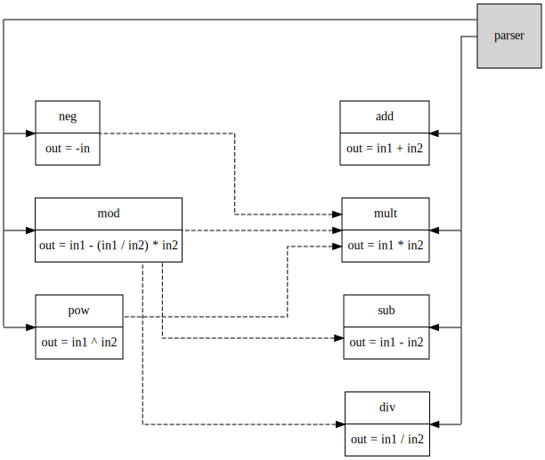

# MicroCalc: A polyglot, microservice-oriented calculator

[](https://github.com/nquocnghia/microcalc/actions?query=workflow%3ACI)

ℹ Looking for a microservice / service mesh sample app ? You might want to have a look at this.

## Services architecture




## Deploy to Kubernetes (Istio required)

**Requirements:** helm

**Commands:**

- Modify `helm/microcalc/values.yaml` and update your domain name
- Execute the following commands to deploy microcalc
```shell
$ kubectl create namespace microcalc
$ kubectl label namespace microcalc -l istio-injection=enabled
$ helm template helm/microcalc | kubectl apply -n microcalc -f -
```

The application will be accessible at:

- Parser service: http://APP_DOMAIN
    - GET /api/v1/status
    - POST /api/v1/calculate

**Run acceptance tests (as Job):** 

```shell
$ kubectl run robot -n microcalc --image=foly/microcalc-robot --restart=OnFailure -l 'app=microcalc-robot'

$ export POD_NAME=$(kubectl get pod -l 'app=microcalc-robot' -n microcalc -o jsonpath --template='{.items[0].metadata.name}')
$ kubectl logs $POD_NAME -n microcalc
```

## Local run

**Requirements:** docker, docker-compose

**Commands:** `$ docker-compose up`

The application will be accessible at:

- Parser service: http://localhost:8080
    - GET /api/v1/status
    - POST /api/v1/calculate

**Run acceptance tests:**

```shell
$ docker-compose -f docker-compose.yml -f docker-compose.ci.yml run --rm robot
```


## Usage guide

- Parser service API

```
POST /api/v1/calculate HTTP/1.1
Content-Type: application/json
[...]

{
    "input": "1+1"
}

HTTP/1.1 200 OK
content-type: application/json
[...]

{
    "operands": [
        1,
        1
    ],
    "origins": [
        {
            "result": 1,
            "service": "name: parser, version: v1"
        },
        {
            "result": 1,
            "service": "name: parser, version: v1"
        }
    ],
    "result": 2,
    "service": "name: add, version: v1"
}
```
